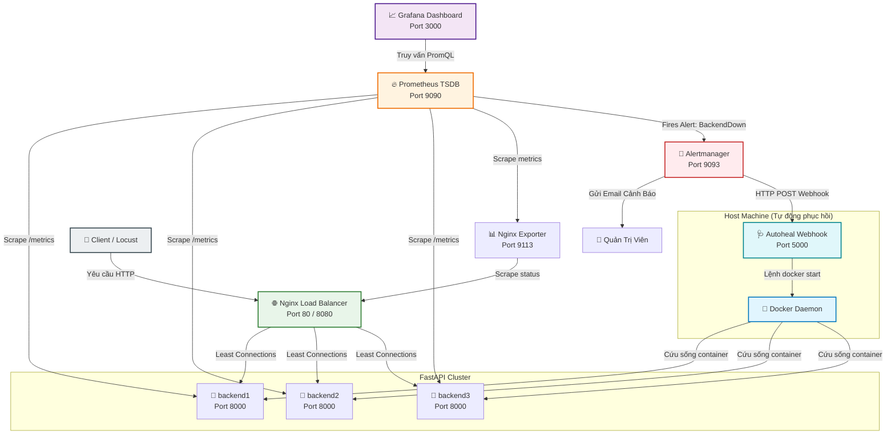

# High-Availability Distributed Server Cluster Deployment

## Đồ Án Hệ Thống Phân Tán: Tự Động Hóa Giám Sát, Cảnh Báo và Phục Hồi (Auto-Healing)

<p align="center">
  
  
  
  
  
  
</p>

---

## 📝 Giới Thiệu Dự Án

Dự án này xây dựng một **Hệ thống phân tán có tính sẵn sàng cao (High Availability - HA)** hoàn chỉnh, tích hợp đầy đủ ba tầng năng lực vận hành hiện đại: **Giám sát chủ động (Monitoring), Cảnh báo tự động (Alerting), và Tự động phục hồi sự cố (Auto-Healing)**. 

Hệ thống được thiết kế theo kiến trúc Microservices và Container hóa, giải quyết triệt để bài toán phân phối tải thông minh, giảm thiểu thời gian gián đoạn dịch vụ (downtime) xuống mức tối thiểu (MTTR cực ngắn) mà không cần can thiệp thủ công từ quản trị viên.

### 🌟 Các Điểm Nhấn Công Nghệ
* **Cân bằng tải tối ưu**: Sử dụng NGINX làm Reverse Proxy với thuật toán **Least Connections (`least_conn`)**, tự động định tuyến các yêu cầu nặng/nhẹ một cách thông minh và có cơ chế dự phòng sự cố (`proxy_next_upstream`).
* **Khả năng quan sát toàn diện (Observability)**: Thu thập metrics hệ thống qua Prometheus và trực quan hóa các chỉ số quan trọng (RPS, Latency, Upstream Status) bằng Grafana Dashboard theo thời gian thực.
* **Quy trình xử lý sự cố khép kín (End-to-End Incident Response)**:
  $$\text{Phát hiện (Prometheus)} \rightarrow \text{Xác minh (Alert rules)} \rightarrow \text{Cảnh báo (Alertmanager)} \rightarrow \text{Cấp cứu (Webhook/Docker API)} \rightarrow \text{Khôi phục (Resolved)}$$

---

## 📐 Kiến Trúc Hệ Thống

Kiến trúc tổng thể của hệ thống gồm các thành phần tương tác chặt chẽ thông qua mạng nội bộ Docker (`lb_network`):



---

## 📂 Cấu Trúc Thư Mục Dự Án

```bash
DoAnHeTTPhanBo/
├── App/                         # Mã nguồn ứng dụng Backend và kịch bản Auto-healing
│   ├── Dockerfile               # Dockerfile build image cho backend FastAPI
│   ├── main.py                  # Mã nguồn FastAPI app (bao gồm cấu hình Prometheus metrics)
│   ├── autoheal.py              # Webhook nhận Alertmanager alerts & thực hiện lệnh docker start
│   └── requirements.txt         # Thư viện Python cần thiết (FastAPI, uvicorn, prometheus-client)
├── alertmanager/                # Cấu hình Alerting
│   └── alertmanager.yml         # Cấu hình gửi mail cảnh báo qua SMTP & gọi Webhook cứu hộ
├── nginx/                       # Cấu hình Load Balancer
│   └── nginx.conf               # Định nghĩa upstream backend cluster & kích hoạt stub_status
├── prometheus/                  # Cấu hình Prometheus
│   ├── prometheus.yml           # Khai báo mục tiêu scrape dữ liệu & tích hợp Alertmanager
│   └── alert_rules.yml          # Định nghĩa luật phát hiện máy chủ sập (BackendDown)
├── docker-compose.yml           # Docker Compose orchestrate toàn bộ dịch vụ
├── locustfile.py                # File kiểm thử tải (Load Testing) với Locust
└── draft-Group05_...docx        # Báo cáo đồ án chi tiết
```

---

## 🛠️ Hướng Dẫn Cài Đặt và Khởi Chạy

### 📋 Yêu Cầu Hệ Thống
* Máy tính đã cài đặt **Docker Desktop** và **Docker Compose**.
* Đã cài đặt **Python 3.9+** trên máy host để chạy Auto-Heal Webhook (hoặc chạy trực tiếp trên môi trường dev).

### 🚀 Bước 1: Khởi chạy các dịch vụ Docker (FastAPI, Nginx, Prometheus, Grafana, Alertmanager)
Mở terminal tại thư mục gốc của dự án và chạy lệnh sau để build và khởi động toàn bộ cụm dịch vụ:

```powershell
docker-compose up -d --build
```

Kiểm tra trạng thái các container hoạt động:
```powershell
docker ps
```
Bạn sẽ thấy 8 container chạy đồng thời: `backend1`, `backend2`, `backend3`, `nginx-lb`, `nginx-exporter`, `prometheus`, `grafana`, và `alertmanager`.

---

### 🩺 Bước 2: Khởi chạy Webhook Auto-Heal trên máy Host
Vì dịch vụ Auto-Heal cần tương tác trực tiếp với **Docker Daemon** của máy Host để chạy lệnh `docker start <container>`, ta chạy script này trực tiếp trên máy Host.

1. Di chuyển vào thư mục `App`:
   ```powershell
   cd App
   ```
2. Cài đặt các thư viện cần thiết:
   ```powershell
   pip install -r requirements.txt
   # Cài thêm thư viện nếu chưa có
   pip install docker
   ```
3. Chạy Webhook Server trên cổng 5000:
   ```powershell
   uvicorn autoheal:app --host 0.0.0.0 --port 5000
   ```

*(Webhook hiện sẽ lắng nghe tại địa chỉ `http://localhost:5000/webhook`, sẵn sàng nhận tín hiệu giải cứu từ Alertmanager).*

---

## 📊 Bảng Tra Cứu Các Cổng Dịch Vụ (Port Map)

| Dịch vụ | Địa chỉ truy cập | Mục đích |
| :--- | :--- | :--- |
| **Nginx Gateway** | `http://localhost:80` | Điểm tiếp nhận request chính của Client. |
| **Nginx Status** | `http://localhost:8080/nginx_status` | Xem số lượng kết nối đang hoạt động của Nginx. |
| **Backend 1, 2, 3** | `http://localhost:8000` (nội bộ Docker) | Các API backend xử lý logic nghiệp vụ. |
| **Prometheus Console** | `http://localhost:9090` | Xem biểu đồ metrics thô và trạng thái Alerts. |
| **Alertmanager UI** | `http://localhost:9093` | Quản lý các cảnh báo đang kích hoạt và cấu hình route. |
| **Grafana Dashboard** | `http://localhost:3000` | Trực quan hóa dữ liệu (Tài khoản: `admin` / Mật khẩu: `admin`). |
| **Auto-Heal Webhook** | `http://localhost:5000` | Endpoint xử lý tự động phục hồi. |

---

## ⚡ Kiểm Thử Tải (Load Testing) với Locust

Dự án sử dụng **Locust** để giả lập hành vi người dùng truy cập đồng thời để kiểm chứng hiệu năng cân bằng tải của Nginx.

1. Cài đặt Locust trên máy host:
   ```powershell
   pip install locust
   ```
2. Khởi chạy Locust:
   ```powershell
   locust -f locustfile.py
   ```
3. Mở trình duyệt truy cập `http://localhost:8089`:
   * **Number of users**: Nhập `100` (Số user mô phỏng).
   * **Spawn rate**: Nhập `10` (Tốc độ tạo user mới mỗi giây).
   * **Host**: Nhập `http://localhost` (Nhắm mục tiêu vào Nginx Load Balancer).
   * Nhấn **Start Swarming** và theo dõi lưu lượng tải phân phối qua đồ thị Grafana.

---

## 🔄 Luồng Tự Động Phục Hồi (Auto-Healing Workflow)

Để kiểm chứng tính năng **Tự động phục hồi** hoạt động chính xác theo quy trình, bạn thực hiện giả lập sự cố sập máy chủ như sau:

### 1. Mô phỏng sự cố (Sập Backend 1)
Chủ động tắt container `backend1` bằng lệnh:
```powershell
docker stop backend1
```

### 2. Tiến trình tự động diễn ra:
1. **Phát hiện (Detect - 0s đến 30s)**:
   * Nginx phát hiện `backend1` sập và tự động chuyển hướng tất cả các request của client sang `backend2` và `backend3` thông qua cấu hình `proxy_next_upstream`. Người dùng cuối **không gặp bất cứ lỗi nào**.
   * Prometheus scrape `/metrics` định kỳ 5s và nhận thấy chỉ số `up{instance="backend1:8000"} == 0`.
2. **Xác minh (Verify - 30s)**:
   * Cảnh báo `BackendDown` chuyển sang trạng thái **PENDING**. 
   * Sau **30 giây** liên tục mất kết nối (tránh cảnh báo giả do mạng chập chờn tạm thời), Prometheus chính thức chuyển cảnh báo sang trạng thái **FIRING** và đẩy tin sang Alertmanager.
3. **Cảnh báo (Alert - ~35s)**:
   * **Alertmanager** tiếp nhận cảnh báo.
   * Gửi email cảnh báo khẩn cấp cho Quản trị viên hệ thống qua hòm thư cấu hình sẵn.
   * Đồng thời kích hoạt webhook gửi một HTTP POST payload chứa thông tin sự cố tới Webhook Server (`http://host.docker.internal:5000/webhook`).
4. **Hành động phục hồi (Action - ~36s)**:
   * Webhook Server nhận payload, bóc tách nhãn `instance` xác định chính xác `backend1` là node bị sập.
   * Chạy lệnh khôi phục khẩn cấp:
     ```powershell
     docker start backend1
     ```
5. **Hoàn tất khắc phục (Resolve - ~45s)**:
   * Container `backend1` được kích hoạt và hoạt động bình thường trở lại.
   * Prometheus thu thập lại được metrics từ `backend1`. Trạng thái cảnh báo chuyển về **RESOLVED**. Hệ thống khôi phục hoàn toàn công suất thiết kế.

---


